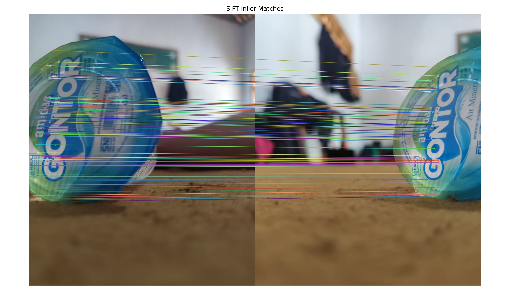
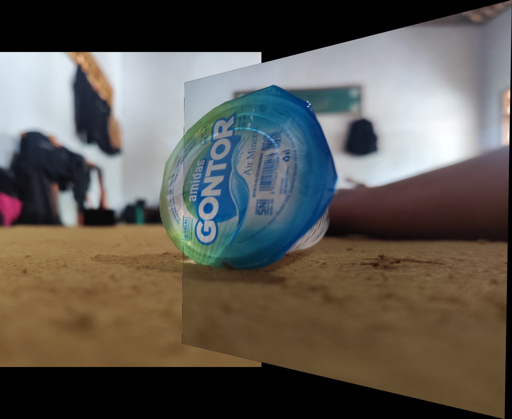

# Final Project - SIFT Feature Detection & Matching

## 📌 Deskripsi
Project ini mengimplementasikan algoritma SIFT (Scale Invariant Feature Transform)
untuk mendeteksi keypoints, melakukan feature matching, dan membangun panorama sederhana.

Metode yang digunakan:
- SIFT Keypoint Detection
- Descriptor Extraction
- BFMatcher
- Lowe Ratio Test
- Homography (RANSAC)
- Image Stitching

---

## 📂 Struktur Folder


---

## ⚙️ Cara Menjalankan

### 1️⃣ Clone Repository
```bash
git clone https://github.com/MauludhaFiozaki/final-project-sift.git
cd final-project-sift


### Keypoints Detection


### Feature Matching


### Panorama Result

